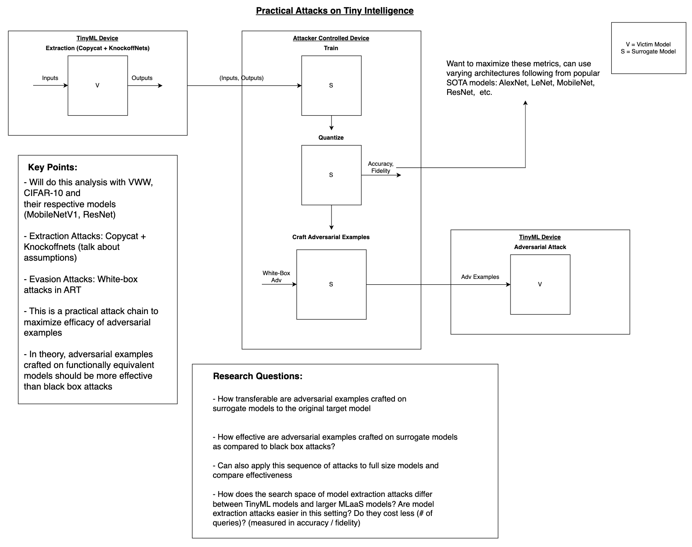
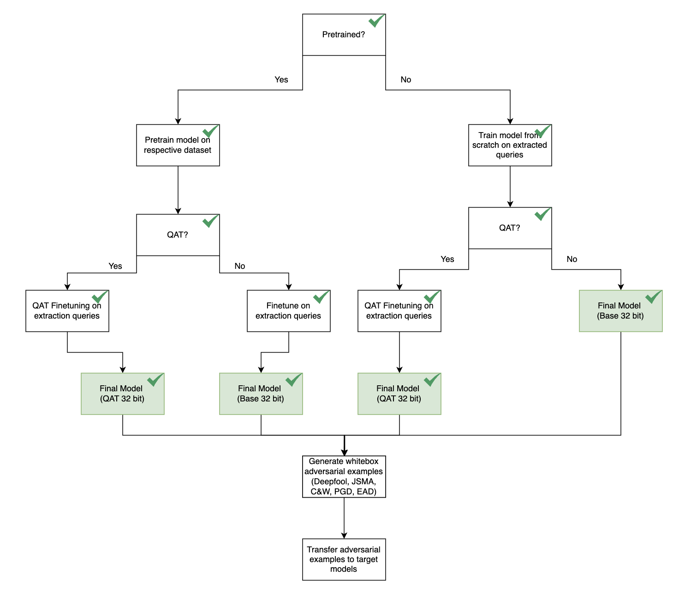

# TinyML_robustness_analysis

## Models to Analyze (Taken from MLPerf Tiny Benchmark): 
- Visual Wake Words (MobileNetV1)
- Image Classification (ResNet)

## Research Questions:

### Model Extraction:
- How does the search space of model extraction attacks differ between TinyML models and larger MLaaS models? Are model extraction attacks easier in this setting? Do they cost less (# of queries)? (measured in accuracy / fidelity)

### Model Evasion (has not been looked at extensively):
- How transferable are adversarial examples generated by functional equivalent models to the target model? (Measured in efficacy)

## Methodology:

Below is a schematic for the methodology of this research. The steps of the attack are as follows:

1. Extract the victim model using Copycat CNN or Knockoff Nets. We are assuming that the model is blackbox, so these two attacks are our best options to get a model we can generate white box adversarial examples on.

2. Train the surrogate model on the extracted input/output pairs.

3. Wrap the surroage model in a Quantized Aware Training Wrapper and get accuracy and fidelity metrics. Fidelity is the most important metric as we want the surrogate model to behave as similar to the target model as possible.

4. Craft adversarial examples on the surrogate models using whitebox attacks from ART.

5. Transfer the adversarial examples generated on the surrogate model to the target model and record results.

## Attack Pipeline (ongoing):

The pipeline diagram below shows a lower level description of how we will carry out this attack. The boxes with green checks have been implemented and the others have not.

