# Project Milestone 5 Organization

```
.
├── LICENSE
├── README.md
├── deliverables
├── pytest.ini
├── src
│   ├── README.md
│   ├── alexnet_cloud
│   │   ├── Dockerfile
│   │   ├── Pipfile
│   │   ├── Pipfile.lock
│   │   ├── cli.py
│   │   ├── cli.sh
│   │   ├── docker-entrypoint.sh
│   │   ├── docker-shell.sh
│   │   ├── package
│   │   ├── package-alexnet.sh
│   │   ├── python_files.tar.gz
│   │   └── requirements.txt
│   ├── alexnet_workflow
│   │   ├── Dockerfile
│   │   ├── Pipfile
│   │   ├── Pipfile.lock
│   │   ├── cli.py
│   │   ├── docker-entrypoint.sh
│   │   ├── docker-shell.sh
│   │   ├── model.py
│   │   └── pipeline.yaml
│   ├── app-building
│   │   ├── Dockerfile
│   │   ├── Dockerfile.test
│   │   ├── README.md
│   │   ├── backend
│   │   ├── docker-build.sh
│   │   ├── docker-shell.sh
│   │   ├── frontend
│   │   └── images
│   ├── art_attacks
│   │   ├── README.md
│   │   ├── __init__.py
│   │   ├── alexnet_attacks
│   │   ├── custom_attacks
│   │   ├── resnet_attacks
│   │   ├── robust_alexnet_attacks
│   │   └── robust_resnet_attacks
│   ├── custom_upload_data
│   │   ├── Dockerfile
│   │   ├── __init__.py
│   │   ├── app.py
│   │   ├── docker-entrypoint.sh
│   │   ├── docker-shell.sh
│   │   └── requirements.txt
│   ├── custom_upload_model
│   │   ├── Dockerfile
│   │   ├── __init__.py
│   │   ├── app.py
│   │   ├── docker-entrypoint.sh
│   │   ├── docker-shell.sh
│   │   ├── requirements.txt
│   │   └── uploads
│   ├── data_alexnet
│   │   ├── Dockerfile
│   │   ├── docker-entrypoint.sh
│   │   ├── docker-shell.sh
│   │   ├── downloader.py
│   │   └── requirements.txt
│   ├── data_resnet
│   │   ├── Dockerfile
│   │   ├── docker-entrypoint.sh
│   │   ├── docker-shell.sh
│   │   ├── downloader.py
│   │   └── requirements.txt
│   ├── deployment
│   │   ├── Dockerfile
│   │   ├── deploy-create-endpoint.yml
│   │   ├── deploy-docker-images.yml
│   │   ├── deploy-model-reg.yml
│   │   ├── deploy.sh
│   │   ├── docker-entrypoint.sh
│   │   ├── docker-shell.sh
│   │   └── inventory.yml
│   ├── deployment.zip
│   ├── deployment_frontend
│   │   ├── Dockerfile
│   │   ├── deploy-full.yml
│   │   ├── deploy-k8s-cluster.yml
│   │   ├── deploy.sh
│   │   ├── docker-entrypoint.sh
│   │   ├── docker-shell.sh
│   │   ├── inventory.yml
│   │   ├── nginx-conf
│   │   └── secrets
│   ├── deployment_upload
│   │   ├── Dockerfile
│   │   ├── deploy-containers.yml
│   │   ├── deploy-docker-images.yml
│   │   ├── deploy.sh
│   │   ├── docker-entrypoint.sh
│   │   ├── docker-shell.sh
│   │   └── inventory.yml
│   ├── pgd_at_alexnet_cloud
│   │   ├── Dockerfile
│   │   ├── Pipfile
│   │   ├── Pipfile.lock
│   │   ├── cli.py
│   │   ├── cli.sh
│   │   ├── docker-entrypoint.sh
│   │   ├── docker-shell.sh
│   │   ├── package
│   │   ├── package-pgd-at-alexnet.sh
│   │   ├── python_files.tar.gz
│   │   └── requirements.txt
│   ├── pgd_at_resnet_cloud
│   │   ├── Dockerfile
│   │   ├── Pipfile
│   │   ├── cli.py
│   │   ├── cli.sh
│   │   ├── docker-entrypoint.sh
│   │   ├── docker-shell.sh
│   │   ├── package
│   │   ├── package-pgd-at-resnet.sh
│   │   ├── python_files.tar.gz
│   │   └── requirements.txt
│   ├── resnet_cloud
│   │   ├── Dockerfile
│   │   ├── Pipfile
│   │   ├── cli.py
│   │   ├── cli.sh
│   │   ├── docker-entrypoint.sh
│   │   ├── docker-shell.sh
│   │   ├── package
│   │   ├── package-resnet.sh
│   │   ├── python_files.tar.gz
│   │   └── requirements.txt
│   └── resnet_workflow
│       ├── Dockerfile
│       ├── Pipfile
│       ├── Pipfile.lock
│       ├── cli.py
│       ├── docker-entrypoint.sh
│       ├── docker-shell.sh
│       ├── model.py
│       └── pipeline.yaml
└── tests
    ├── README.md
    ├── requirements.txt
    ├── test_alexnet_attacks.py
    ├── test_alexnet_attacks_robust.py
    ├── test_alexnet_downloader.py
    ├── test_custom_attacks.py
    ├── test_custom_upload_data.py
    ├── test_custom_upload_model.py
    ├── test_endpoints.py
    ├── test_resnet_attacks.py
    ├── test_resnet_attacks_robust.py
    ├── test_resnet_downloader.py
    └── uploads
        ├── empty_model.zip
        ├── model.h5
        └── model.zip
```

# AC215 - Milestone 5 - Adversarial Playground

**Team Members**
Jacob Huckelberry, Elijah Dabkowski, Edward Tang

**Group Name**
Black Knights

**Project:**
In this project, we aim to develop a framework to investigate the effects of adversarial attacks on image classification models. The app will feature two image classification networks trained to make medical diagnoses and classify street signs--both critical functionalities with large consequences in instances of failure. The user will then be able to use the Adversarial Robustness Toolbox to perform preset attacks against these models to demonstrate their efficacy. Complementary to these two models, there will be 'robust' versions of these models the user may also test. These models were fine-tuned using PGD adversarial training. In addition to the two base models and their adversarially finetuned versions, the user will be able to upload a model and data to test the adversarial robustness of their own model.

# Milestone 5

In this milestone, we have added the finishing touches to our project, including the usage of Kubernetes to scale our application, ansible playbooks to automate provisioning and deployment, a CI/CD pipeline that runs tests, and deploys updates to our Kubernetes cluster, and, finally, a complete ML workflow that downloads the datasets of interest, trains the base models, and fine-tunes adversarially robust versions using PGD adversarial training.

## Technical Implementation

A low-level overview of our technical implementation can be seen in our technical architecture below.

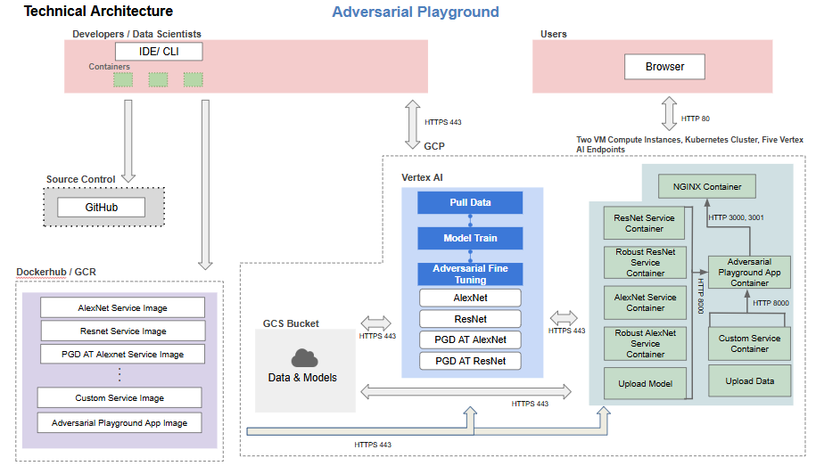

As you can see in this image, we made use of several different tools to create our application. For development our group memebers made use of local environments, Github for source control, and Dockerhub and GCR for storing our containers for deployment. We make use of our pushed container images to pipeline training for our models in Vertex AI. Our pipeline for both models, AlexNet and ResNet, consist of downloading the data from kaggle, training the base models, and then carrying out adversarial finetuning on our models. Both versions of both models are then saved to cloud buckets for use in our service containers.

Our application architecture makes use of 9 different containers. These containers have the following functionalities:
- Model service containers
    - There is a container for each different model that can be tested (ResNet, PGD AT Resnet, Alexnet, PGD AT Resnet, and Custom models). These five containers are exposed as Vertex AI endpoints and allow users to launch different adversarial attacks on the five kinds of models.
- Upload data and Upload model containers
    - These two containers implement the functionality that allows the user to upload their own model in a .h5 format and their data as a zip. These two containers are hosted as VM instances in GCP compute engine.
- Adversarial Playground app container
    - This container implements our user-friendly react front end. It exposes ports 3000 and 3001 to the NGINX webserver.
- NGINX container
    - Our NGINX container implements our webserver that exposes our react front end to the user in their browser.

### Kubernetes Deployment

Our Kubernetes cluster contains the images for our front end and webserver. We chose only to use Kubernetes for these two components because everything else is implemented in Vertex AI endpoints, which have their own scaling methods built in. Below is an image of our deployed cluster.

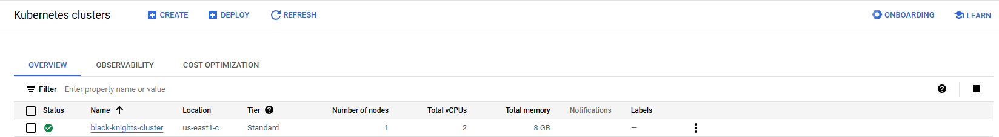

As we can see in the images below, our cluster has auto-scaling implemented to scale our application when the loads increase or our frontend crashes.

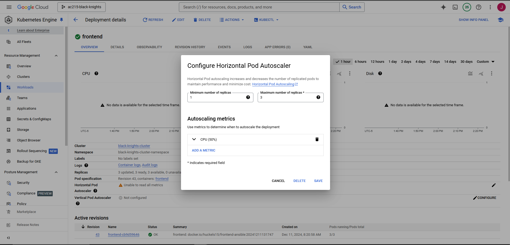


### Ansible Playbooks for Automated Deployment

In order to automate the provisioning and deployment of our application, we made use of ansible playbooks. We had several playbooks associated with deploying each of the components. The playbooks for deploying our backend vertex ai endpoints can be found in `/deployment`, the playbooks for deploying our react front end and kubernetes cluster can be found in `/deployment_frontend`, and our playbooks for deploying our custom upload functionalities can be found in `/deployment_upload`. More about how to use these will be covered in the deployment section below.

### Machine Learning Workflows

In this project, we made use of four different models, a ResNet, PGD-AT ResNet, AlexNet, and PGD AT AlexNet. In order to train these models, we implemented two seperate ML workflows. Each workflow does the same thing, but for different models. In both workflows, the data is downloaded from kaggle, the data is used to train the models, and then we conduct PGD adversarial training. PGD adversarial training consists of generating adversarial examples using PGD on the training data, then finetuning the model on these adversarial examples. The two different workflows can be found in the `alexnet_workflow` and `resnet_workflow` directories. For our workflow, we did not include a model validation step. This is because we are not attempting to create a SOTA computer vision model. That is, as long as the models are sufficiently trained, we are able to attack them and get meaningful results. Usage for these workflows will be explained later in this README. Below are some images of our workflows successfully completing in GCP.

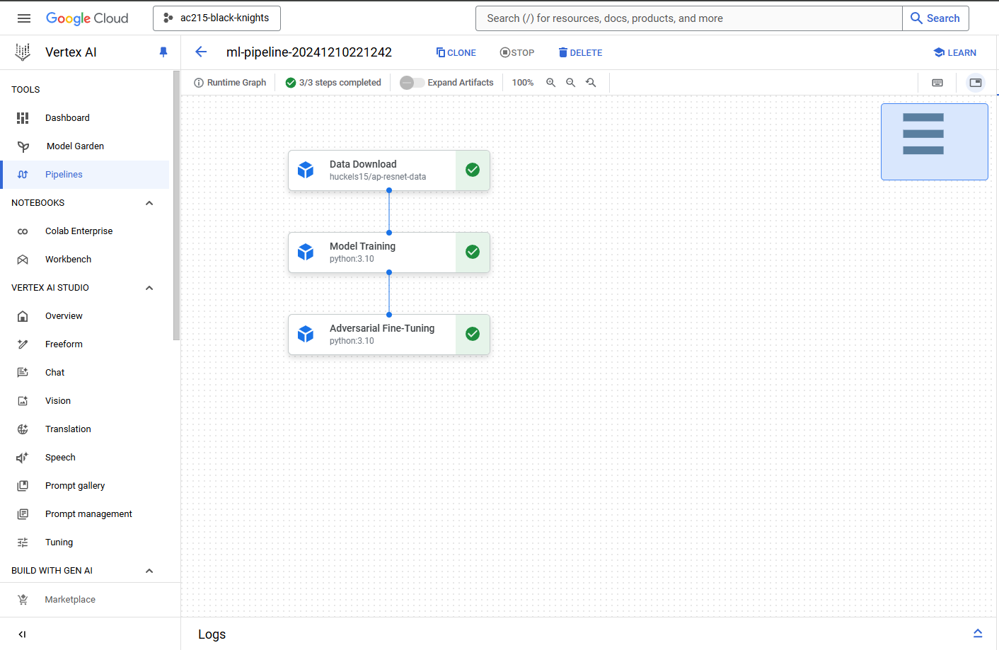
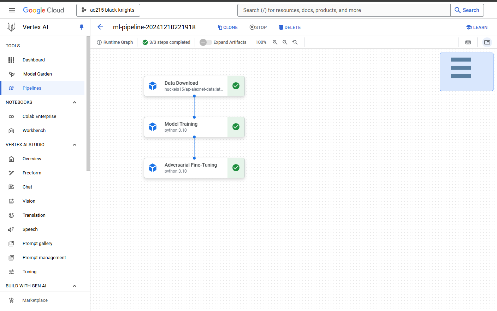

### CI/CD Pipeline Implementation

Complemetary to our ML workflows and ansible playbooks is our CI/CD pipeline. Our CI/CD pipeline consists of four workflows, one to trigger our ML workflow, one to automatically deploy our app components on updates, one to test our python modules, and one to lint our JS. These workflows can be found in `./github/workflows`. In order to trigger our ML workflows, one must enter `run-resnet-pipeline`, `run-alexnet-pipeline`, or both in the commit message. These will run the pipelines described above. In order to trigger a build and deploy for our app, one must include `/deploy-app` in the commit messsage. This will trigger all of the ansible playbooks in the `/deployment`, `/deployment_frontend`, and `/deployment_upload` directories and build and deploy our app. On every push to main, our CI/CD pipeline will test all of the python modules and lint our JS. Examples of each of these workflows completing can be seen in the screenshots below.

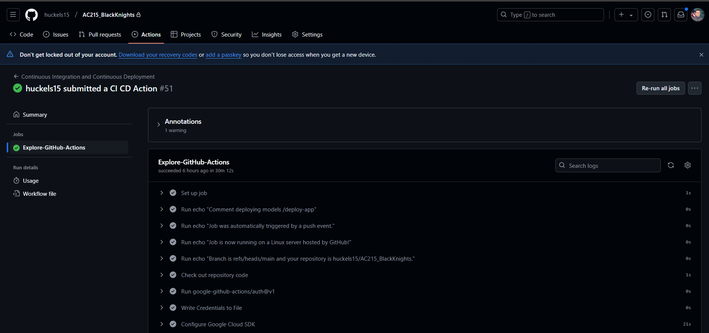

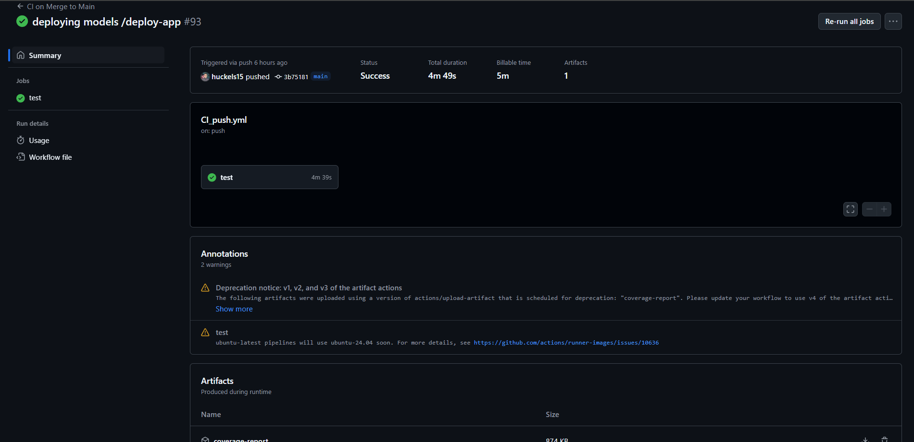

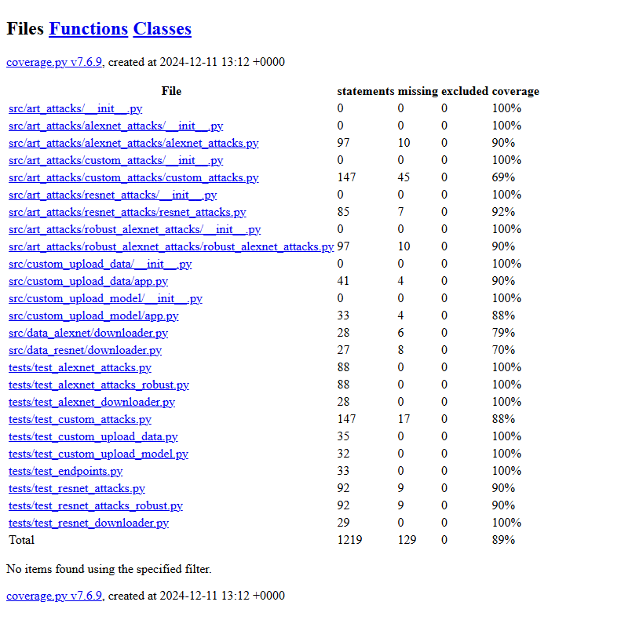

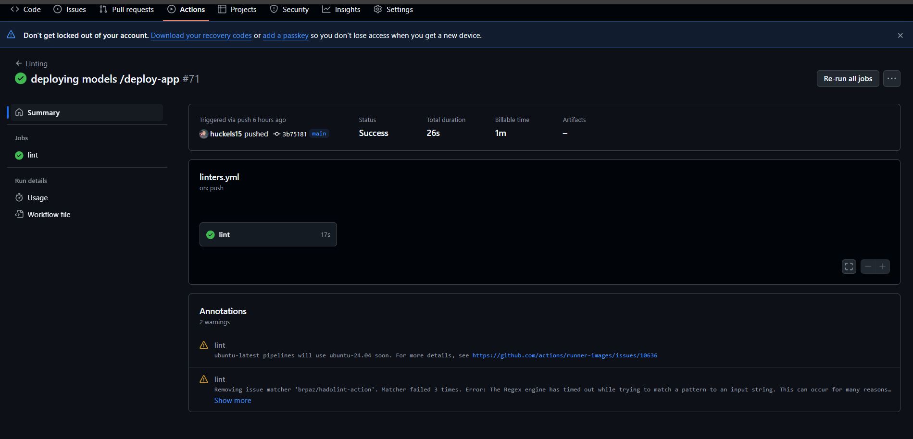

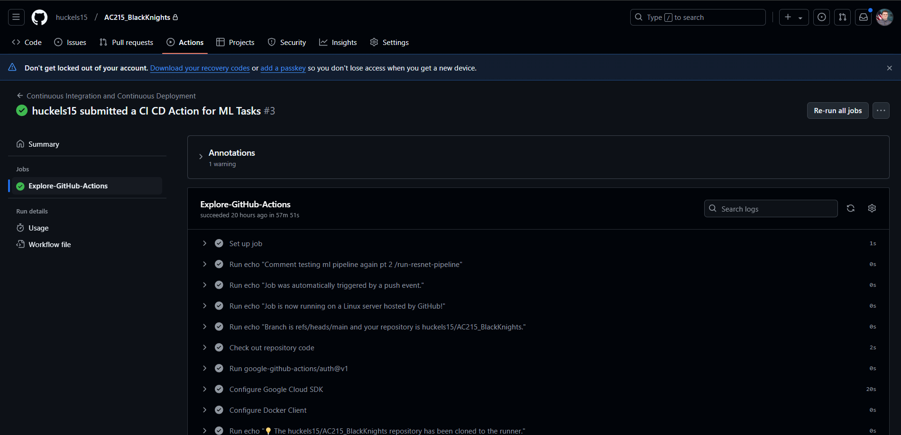

## Prerequisites

In order to set up our application, you must have an active Google Cloud account and project. Additionally, you must have Docker installed to make use of our automated deployment. With these two tools, you are able to proceed to setting up the app.

## Setup Instructions

The majority of the setup to get our code running in your project involves creating the neccesary service accounts in your Google Cloud project, enabling the proper apis, and creating buckets. Below, we list the APIs you must enable, the service account you must use, and the buckets you must create.

### Required APIs
- Compute Engine API
- Vertex AI API
- Kubernets Engine API
- Artifact Registry API
- Cloud Resource Manager API

### Setup GCP Service Account for deployment
- To setup a service account you will need to go to [GCP Console](https://console.cloud.google.com/home/dashboard), search for  "Service accounts" from the top search box. or go to: "IAM & Admins" > "Service accounts" from the top-left menu and create a new service account called "deployment". 
- Give the following roles:
- For `deployment`:
    - Compute Admin
    - Compute OS Login
    - Container Registry Service Agent
    - Kubernetes Engine Admin
    - Service Account User
    - Storage Admin
    - Vertex AI Administrator
- Then click done.
- This will create a service account
- On the right "Actions" column click the vertical ... and select "Create key". A prompt for Create private key for "deployment" will appear select "JSON" and click create. This will download a Private key json file to your computer. Copy this json file into the **secrets** folder.
- Rename the json key file to `deployment.json`
- repeat this process for a service account called `ml-workflow` that has the following roles:
    - AI Platform Admin
    - Service Account User
    - Storage Admin
    - Vertex AI Admin

### Required Buckets
You must now create the following buckets:
- adversarial-playground-alexnet-workflow
- adversarial-playground-resnet-workflow
- alexnet-data-wf
- alexnet-models-ac215
- alexnet-trainer
- custom-attacks-multi
- pgd-at-alexnet-models-ac215
- pgd-at-alexnet-trainer
- pgd-at-resnet-models-ac215
- pgd-at-resnet-trainer
- resnet-data-wf
- resnet-models-ac215
- resnet-trainer

### Deployment Instructions

You can now follow the next steps to deploy our app to your project. First, clone this repo.

1. ML Workflow
    - Navigate to `/alexnet_cloud`
    - run the `docker-shell` script to get into the neccesary container
    - run `./package-alexnet.sh` to send the `alexnet-trainer.tar.gz` to the cloud
    - Navigate to `/pgd_at_alexnet_cloud`
    - run the `docker-shell` script to get into the neccesary container
    - run `./package-pgd-at-alexnet.sh` to send the `pgd-at-alexnet-trainer.tar.gz` to the cloud
    - Navigate to `/data_alexnet`
    - run the `docker-shell` script
    - push the built container to the registry of your choice for use in the ML pipeline
    - navigate to `/alexnet_workflow`
    - run the `docker-shell` script
    - run `cli.py --pipeline` to begin your model training and adversarial finetuning
    - repeat this process for resnet and you will have your models and data in your gcp buckets
2. Deployment
    - navigate to the `/deployment*` directories
    - run the `docker-shell` file to be put into a container that has gcloud cli, kubernetes, and ansible downloaded.
    - run `deploy.sh` to deploy the respective components
    - repeat this process in `/deployment`, `/deployment_frontend`, and `/deployment_upload` to deploy our backend, frontend, and upload functionalities, respectively.

## Usage Details

With all of the components deployed, you can then navigate to the ip address output by the frontend deployment to get to our app. In you web browser, go to the address http://x.x.x.x.sslip.io. This will bring you to our landing page:

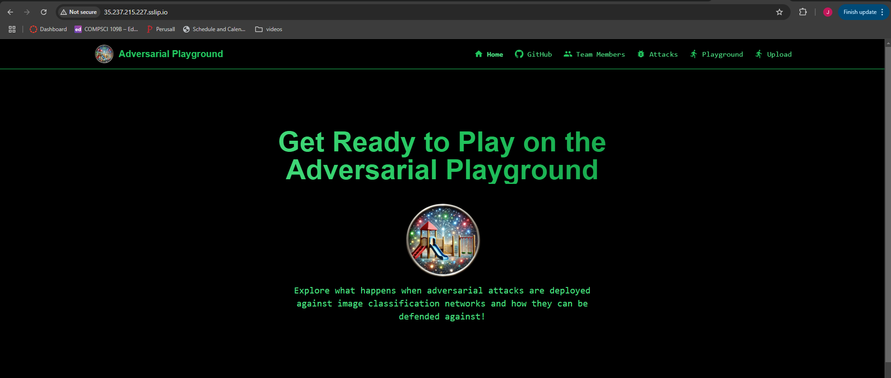

From here, you can navigate to the Github page in the top right to access the link to our github:

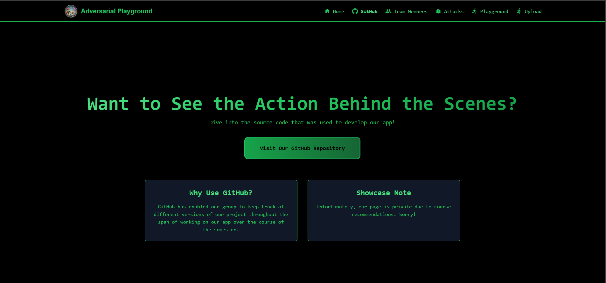

Our attacks page, which gives a high level overview of the attacks the user can launch on the models and links to their papers:

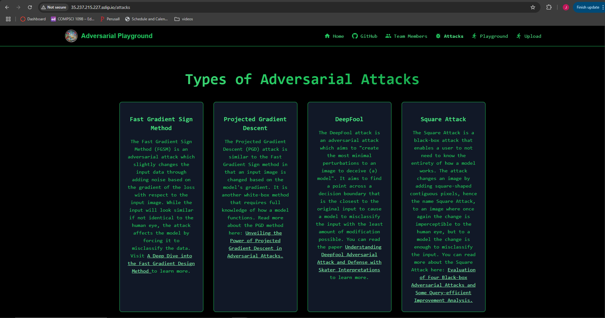

And, the fun parts, the playground page which allows the user to interact with and attack models or the uploads page which allows the user to upload their own model and data to attack:

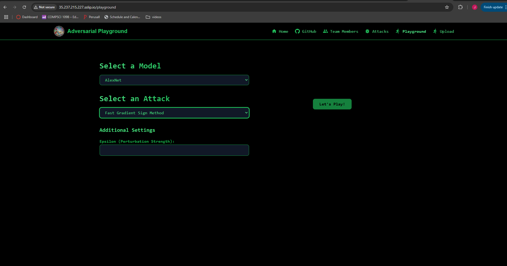

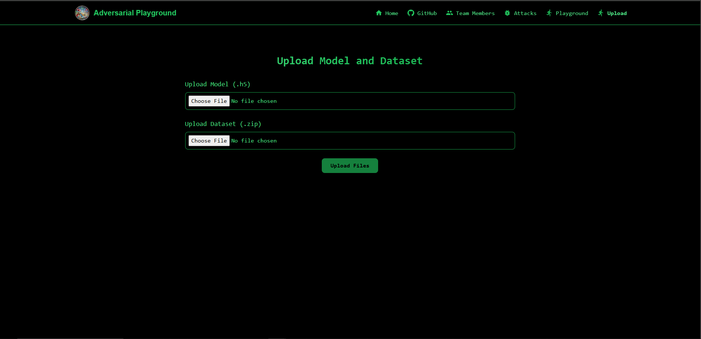

## Example Usage

In this section, we will show two examples of how you can use our app. In the first, we show how you can attack one of our pretrained models. In the next, we show how you can attack your own model.

### Attacking Resnet
- Navigate to the playground page on the website
- select Resnet as the model
- select any attack and its respective parameters. For This, we will choose PGD with parameters 0.2 for epsilon, 10 for max iterations, and 0.01 step size.
- click lets play and await results

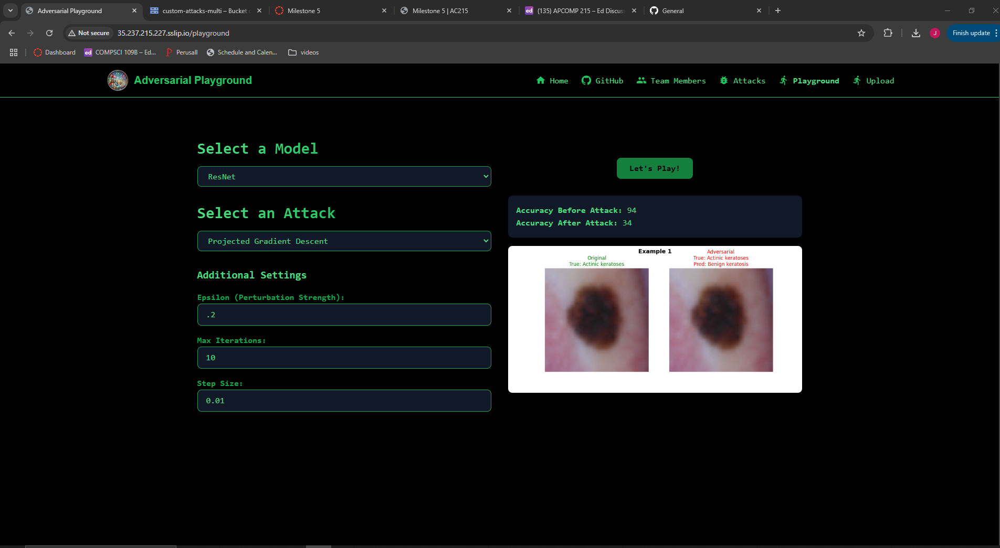


### Attacking a Custom Model
- navigate to the upload page
- upload your model file. It must be in .h5 format specifically.
- upload your data that will be used to generate adversarial examples. It must be zipped.
- navigate back to the playground page.
- select custom attack for the model drop down.
- select your attack, for this, we will use FGSM.
- type in the name of the model you uploaded in the `model name` box, do not include the file extension
- type in the name of the data zip you uploaded in `Dataset name`. Do not include a file extension.
- enter the width, height, and channels (shape) of the data you uploaded.
- enter the attacks parameters
- click lets play and await results!
- For this, we used a toy MNIST CNN example. Due to networking bottlenecks, we only upload a small dataset to test the model with. That is, the data the custom model is tested on and has examples generated with only consists of about 500 images, while mnist is 60000 images in reality. This causes the accuracy before and after the attack to be extremely low in both cases. However, in our local testing with the full dataset, the metrics were similar to that of the resnet attack. More will be discussed about this in the known issues and limitations section.

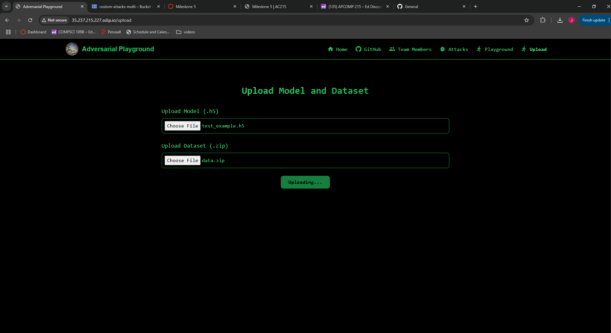


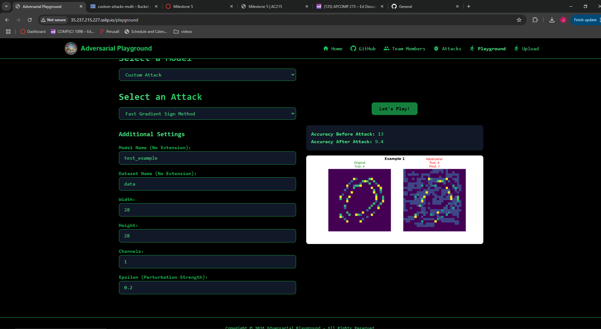


## Known Issues and Limitations

At the end of our project, the only real issue with our app is the networking bottleneck associated with the custom model and data upload process. The attacks in and of themselves take quite a while to execute. Coupled with a long run time to upload the data and model, this becomes quite frustrating. To our knowledge, there is no real solution to this as throwing more compute or GPUs at this issue will not help us un-bottleneck the network when uploading artifacts. As a result, for the example in this README and our demo, we only used a small dataset for our custom model attacks. This results in poor model performance both on the clean and perturbed data since 500 images is certainly not representative of a dataset with 60000 samples in total.

## Sources:

1. https://www.kaggle.com/datasets/valentynsichkar/traffic-signs-dataset-in-yolo-format
2. https://huggingface.co/datasets/marmal88/skin_cancer  
