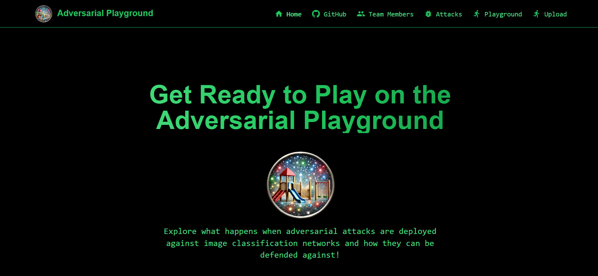
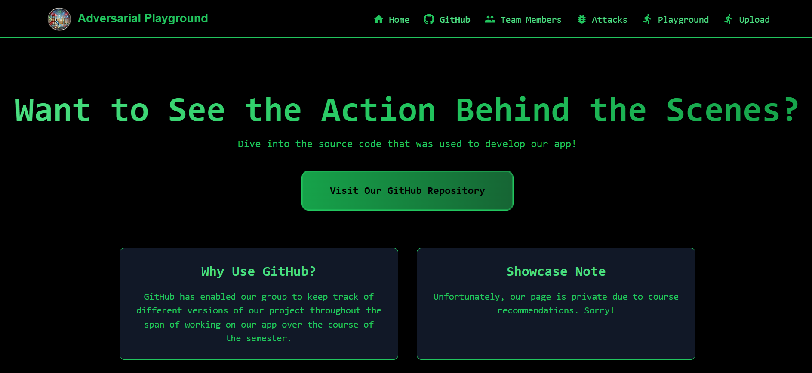
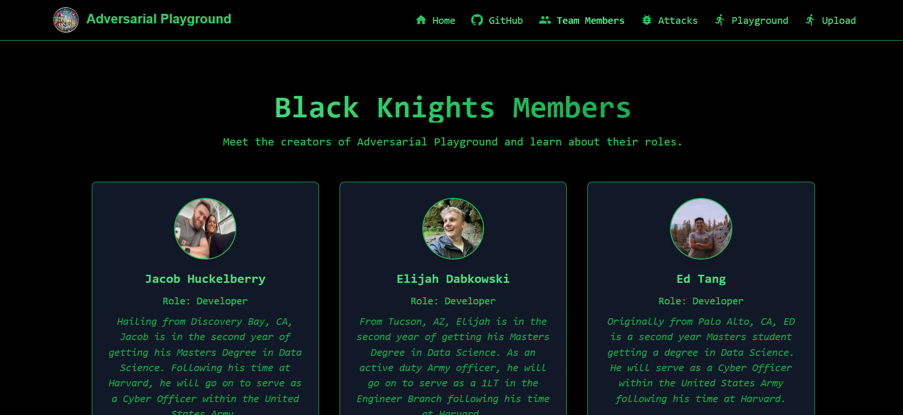
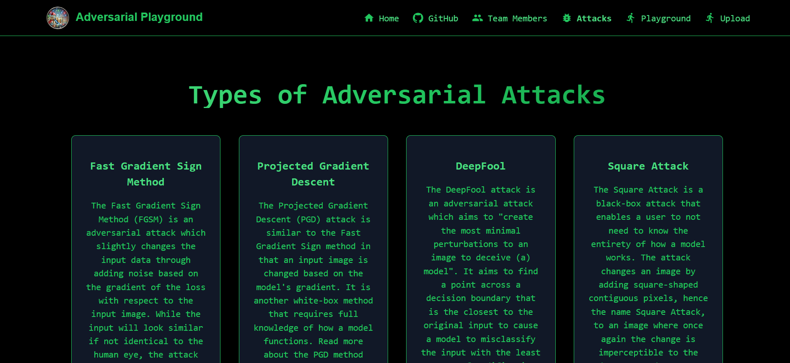
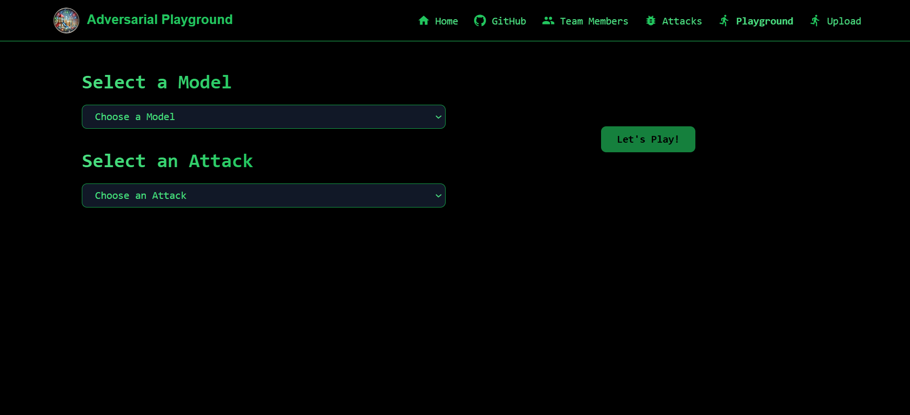
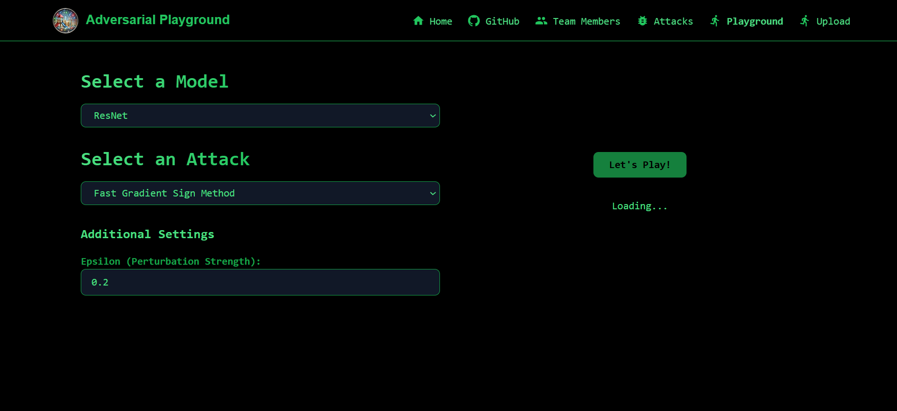
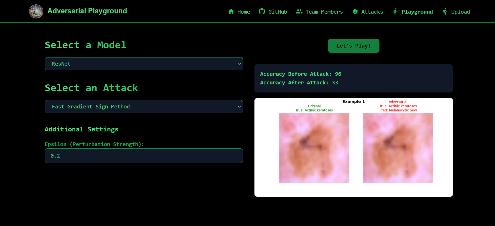
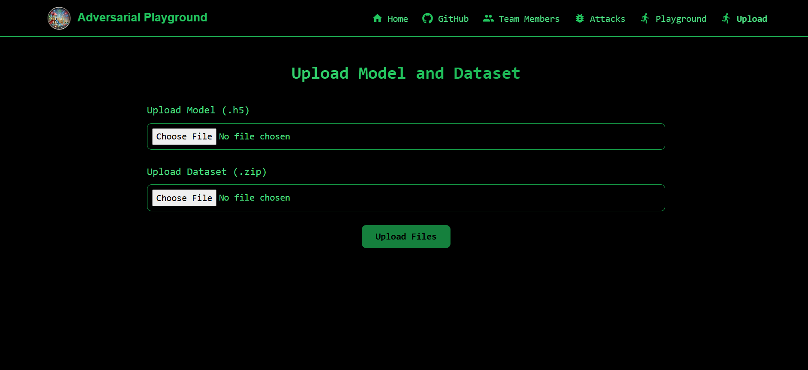
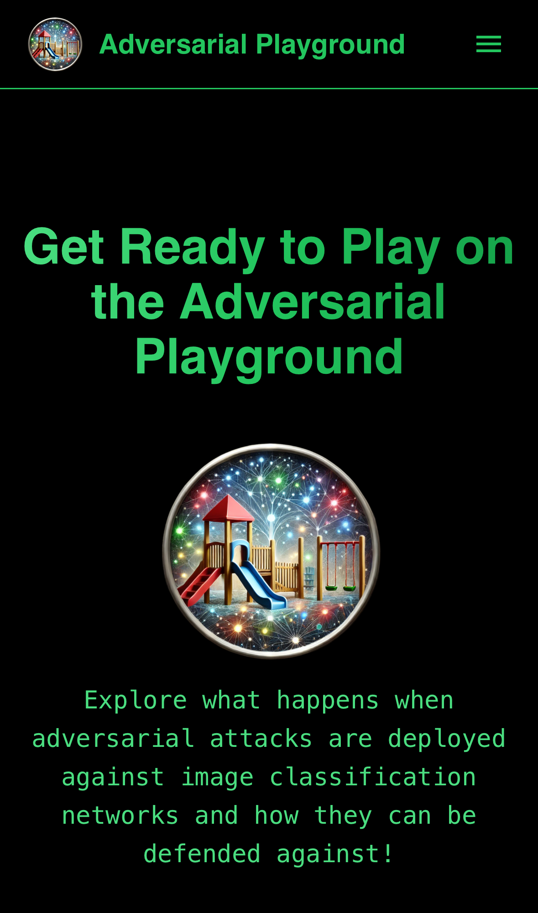
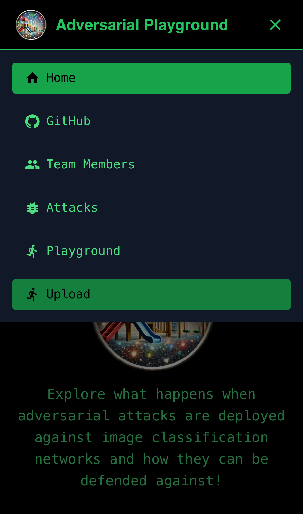

# Adversarial Playground App - Black Knights
 


In this README we will review how to interact with our frontend browser and the overall code structure which models our app.

## Prerequisites
* Be able to access the internet through a browser
* Have Docker installed
* Have some form of IDE 
* Access to GCP

## Interacting w/ the Adversarial Playground App (Setup Instructions)
* If you would like to run our solution:
    * Navigate to http://35.237.215.227.sslip.io
    * Play around on our virtual playground app!
* If you would like to create your own app or modify our functionality:
    * Begin by cloning this repository
    * Navigate your way through the files until you reach the app-building/ directory
    * If you wish to modify the frontend which controls the web browsing experience and how the user interacts with the web page directly (such as changing how the app is displayed) begin by changing your way into the /frontend directory.
      * Modify  docker-shell.sh to contain whatever image name you want along with ensuring that the Dockerfile.dev file is the docker file being built.
      * Run ```sh docker-shell.sh``` to build and enter into the container
      * Run ```npm install```
      * Run ```npm run dev``` on your own machine and navigate your way to http://localhost:3000 to see the webpage.
      * You can now make changes and edit our implementation if you so wish.
      * Run the following commands in order to update your package.json file while the container is still active
        * ```npm install```
        * ```npm run build```
        * ```npm ci```
    * Exit the container and return back to the root of the app-building/ directory
    * If you wish to modify the backend of the web app which handles things such as authenticating a user and sending post requests back to the Vertex AI endpoints that we have in place, follow these commands: 
      * Run ```sh docker-build.sh``` located within the root of the app-building/ directory, select [1] to build an image, and change into the /backend/ directory
        * Important Note: The previous frontend steps can be performed working within this Dockerfile as well. Instead of running ```sh docker-shell.sh``` from within the /frontend/ directory, you can run ```sh docker-build.sh``` from the root of the app-building directory and navigate into the /frontend/ directory and then perform all of the other steps
      * While within the /backend/ directory, you can modify the server.js file to update our Node.js file which handles things such as connecting the backend portion of the web browser to the backend Vertex AI endpoints
      * Ensure to run ```npm install ___``` replacing ___ with whatever packages you need in addition to the ones already located within the package.json file
    * Once satisfied, run ```sh docker-shell.sh``` from the root of the app-building/ repository and wait for it to load and run
    * Once running, use ^C to exit the container and then tag your docker image on your local device using ```docker tag <image-name>:latest <docker-username>/<image-name>:<tag>``` replacing \<docker-username> with your Docker username, \<image-name> with the name of your image (whatever you called it within the docker-shell.sh file in the root of the app-building directory/) and \<tag> with whatever you used as the tag
    * Proceed with pushing this image to DockerHub using ```docker push <docker-username>/<image-name>:<tag>```
    * If you would like to deploy this yourself on a VM using GCP:
      * Navigate to GCP and find your way to the Compute Instance section
      * Select *Create Instance* 
      * Under *Machine configuration*, choose an appropriate name
      * You can skip *OS and storage* as we will add a startup script to pull and run your pushed Docker image
      * Within *Networking* under the firewall section, select *Allow HTTP traffic* and *Allow HTTPS traffic*
      * Skip *Observability*
      * Within *Security* under the Identity and API access section, select a service account that has all the proper permissions (recommended permissions are __) and under the Access scopes section select *Allow full access to all Cloud APIs*
      * Within the *Advanced* section, find your way to the Automation portion and enter these commands for the Startup script
        * #!/bin/bash
        * set -ex
        * apt-get update
        * apt-get install -y docker.io
        * systemctl start docker
        * docker pull \<docker-username>/\<image-name>:\<tag> (again replace the portions inside \<> with your information)
        * docker run --restart=always -d -p 3000:3000 -p 3001:3001 \<docker-username>/\<image-name>:\<tag>
      * You can now ssh into the VM and run ```sudo journalctl -u google-startup-scripts.service``` in order to see the startup scripts and ensure that the frontend is running
      * Once confirmed, navigate to http://\<external-IP>:3000 replacing \<external-IP> with the external IP of your VM in order to see the website
      * **Important Note:** Currently within the /app-building/frontend/src/components/playground/ files, the system is set up for kubernetes deployment, so the routing between the visual display of the frontend, backend service of the frontend, and backend Vertex AI endpoints will not be able to communicate if these files are not changed. You would need to adjust the backendBaseUrl variable located near the top of each of these files and change the \/port3001 located at the end to :3001 instead
        * This fix should work but if errors persist we recommend opening up the console logs to debug
    * For Kubernetes deployment:
      * Migrate out of the app-building/ directory and enter the deployment_frontend/ directory
      * Pull up the deploy-k8s-cluster.yml file and change the image that is being loaded into the pods from ```docker.io/huckels15/frontend:1.6``` to ```docker.io/<docker-username>/<image-name>:<tag>``` replacing the portions within the <> blocks to your information
      * Navigate to http://35.237.215.227.sslip.io to view your app
        * **Important Note:** On occasion, it takes a second to update the changes. If this is the case wait a minute or two and then revisit http://35.237.215.227.sslip.io 

## Usage Guidelines
After navigating to http://35.237.215.227.sslip.io you will find yourself on the apps landing page



You can use either the five clickable header links at the top of the landing page or the five clickable tabs at the bottom of the landing page to access other sections within our app. To start off, try navigating to our Github tab, you will be taken to a page which enables the user to navigate to our github repository.



Navigating to the Team Members tab, you will be able to learn more about the background and future of each of the three members of the Black Knighs.



If you are unfamiliar with the world of adversarial attacks, check out the Attacks tab to learn about the four attacks implemented with helpful links to provide more information on how these attacks work.



Play around on our adversarial playground by navigating to the Playground tab, where you will be able to select both a model and type of attack you would like to use along with the parameters necessary to run these attacks in order to see what the test accuracy of the selected model would be both before and after an attack has taken place.





Finally, if you would like to upload your own model and dataset to run attacks against, navigate to the Upload tab where you can send a .h5 model file along with a zipped dataset back to our buckets in order to test the robustness of the model against the four types of attacks within the Playground tab.



Additionally, for all you mobile users, our app is set up to work seemlessly for mobile interaction as well!




## Application Components 

### General Code Tree (app-building directory)
```
.
├── Dockerfile
├── Dockerfile.test
├── README.md
├── backend
│   ├── package-lock.json
│   ├── package.json
│   └── server.js
├── docker-build.sh
├── docker-shell.sh
├── frontend
│   ├── Dockerfile
│   ├── Dockerfile.dev
│   ├── docker-shell.sh
│   ├── jsconfig.json
│   ├── next.config.js
│   ├── package-lock.json
│   ├── package.json
│   ├── postcss.config.js
│   ├── public
│   │   └── assets
│   │       ├── advplayground.png
│   │       ├── black_knight.png
│   │       ├── ed.jpeg
│   │       ├── eli.jpg
│   │       └── jacob.jpg
│   ├── src
│   │   ├── app
│   │   │   ├── attacks
│   │   │   │   └── page.jsx
│   │   │   ├── github
│   │   │   │   └── page.jsx
│   │   │   ├── globals.css
│   │   │   ├── globals.neon.nights.css
│   │   │   ├── hacker.css
│   │   │   ├── layout.js
│   │   │   ├── layout.jsx
│   │   │   ├── members
│   │   │   │   └── page.jsx
│   │   │   ├── not-found.jsx
│   │   │   ├── page.jsx
│   │   │   ├── playground
│   │   │   │   └── page.jsx
│   │   │   └── upload
│   │   │       └── page.jsx
│   │   └── components
│   │       ├── layout
│   │       │   ├── Footer.jsx
│   │       │   └── Header.jsx
│   │       ├── playground
│   │       │   ├── DEEPFOOLalex.jsx
│   │       │   ├── DEEPFOOLalexrob.jsx
│   │       │   ├── DEEPFOOLcustom.jsx
│   │       │   ├── DEEPFOOLres.jsx
│   │       │   ├── DEEPFOOLresrob.jsx
│   │       │   ├── FGSMalex.jsx
│   │       │   ├── FGSMalexrob.jsx
│   │       │   ├── FGSMcustom.jsx
│   │       │   ├── FGSMres.jsx
│   │       │   ├── FGSMresrob.jsx
│   │       │   ├── PGDalex.jsx
│   │       │   ├── PGDalexrob.jsx
│   │       │   ├── PGDcustom.jsx
│   │       │   ├── PGDres.jsx
│   │       │   ├── PGDresrob.jsx
│   │       │   ├── SQUAREalex.jsx
│   │       │   ├── SQUAREalexrob.jsx
│   │       │   ├── SQUAREcustom.jsx
│   │       │   ├── SQUAREres.jsx
│   │       │   └── SQUAREresrob.jsx
│   │       └── upload
│   │           ├── uploadData.jsx
│   │           └── uploadModel.jsx
│   ├── tailwind.config.js
│   └── test_attack.sh
└── images
    ├── advplayground.png
    ├── black_knight_2.png
    ├── playground-01.png
    ├── playground-02.png
    ├── playground-03.png
    ├── playground-04.png
    ├── playground-05.png
    └── playground-06.png
```

### General Code Overview
* Within the main app-building directory is the README.md file, an images directory, a frontend directory, a backend directory, and Docker specific files. The images directory contains the images that are shown within the README.md file while the frontend directory contains the code that is utilized to build the React app. The backend directory contains the code that is utilized to run our Node.js application. Within frontend directory lies the src directory containing the react source code and a multitude of other files which handle app operations. Additionally, the public directory within the frontend directory contains the static images that are used within the app.

### React Source Code Tree (app-building/frontend/src directory)

```
.
├── app
│   ├── attacks
│   ├── github
│   ├── globals.css
│   ├── globals.neon.nights.css
│   ├── hacker.css
│   ├── layout.js
│   ├── layout.jsx
│   ├── members
│   ├── not-found.jsx
│   ├── page.jsx
│   ├── playground
│   └── upload
└── components
    ├── layout
    ├── playground
    └── upload
```

### React Source Code Overview
* Within the React source code directory lies two other directories, including /app and /components. The /app folder contains the react pages while the /components folder holders the react components. The react pages directory contains the home page file (page.jsx) along with the specific page directories and subsequent page files such as /playground/page.jsx which are used to build what the user sees and interacts with on the frontend of our app. The react components directory contains the layout directory which is used to create the header and footer that is populated on every page of our app along with the playground directory which contains 20 seperate files, all of which interact with the backend to send a request and recieve a response for a models performance before and after an adversarial attack takes place. The upadte directory within the components directory handles uploading both data and models to our GCP buckets. The page.jsx files within the /app folder then collect the specific response from these component files to populate the frontend with the output from our models running on the backend or a success notificaiton if the user uploaded data and model was success. 

### Node.js Source Code Tree (app-building/backend directory)

```
.
├── package-lock.json
├── package.json
└── server.js
```

### Node.js Source Code Overview
* Within the backend directory lies three different files. The package.json and package-lock.json are used to store dependencies and necessary packages while the server.js is what serves as a communication point between the frontend web browser and the backend Vertex AI endpoints. It runs on port 3001 and handles specifications to the /api/prediction route from the frontend. This communication point is necessary as it enables us to collect the credentials from our service account in order to interact with the backend Vertex AI endpoints. Essentially, the server.js file accepts the payload from the frontend web browser, sends a POST request back to the Vertex AI endpoints with the payload along with the necessary credential token to authorize, recieves the response from the Vertex AI endpoints and then forwards this response back to the frontend for display. 